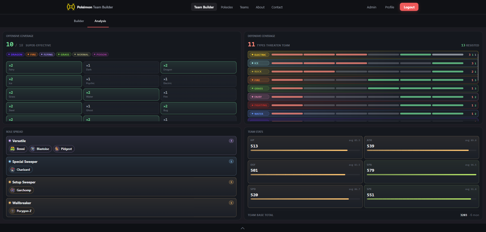
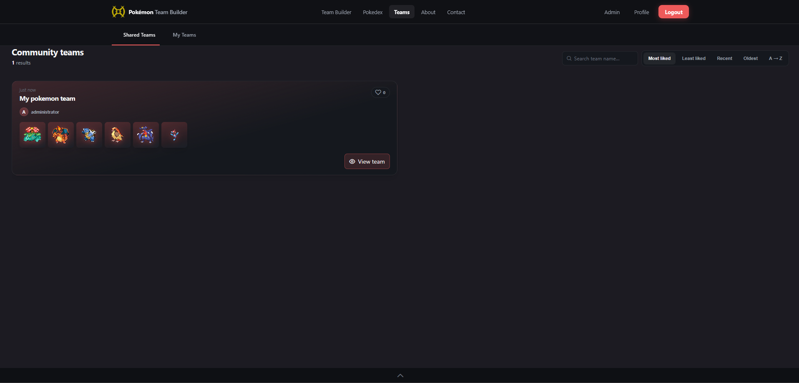
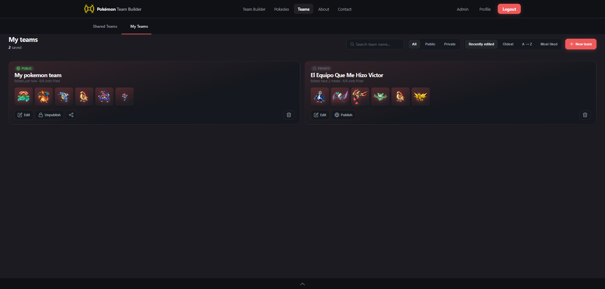
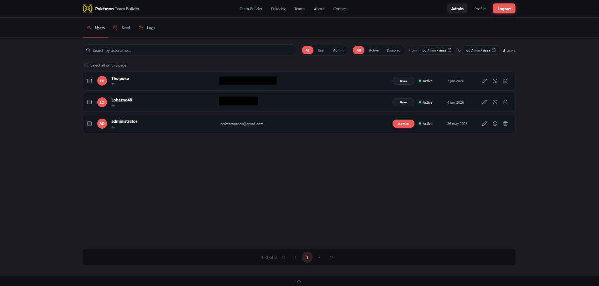
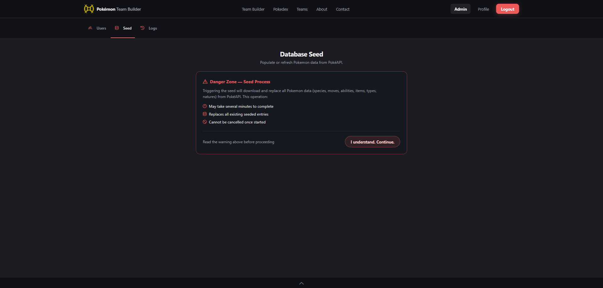
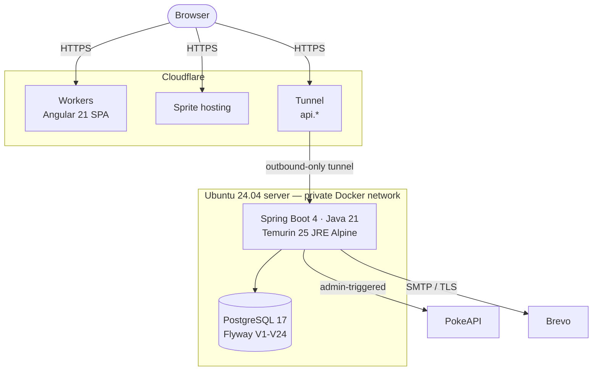
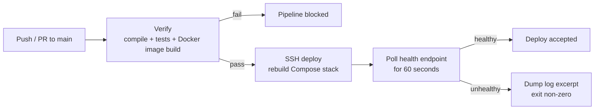

<div align="center">

# PokeTeam Builder - Backend

**REST API powering [pokemon-team-builder.com](https://pokemon-team-builder.com)**

A competitive team builder with a full reference Pokedex, a team analysis engine,
community sharing and an administration panel.

<br>

[](https://pokemon-team-builder.com)
[](https://api.pokemon-team-builder.com)
[](https://github.com/ManusolJ/pokemon-frontend)

[](https://openjdk.org/)
[](https://spring.io/projects/spring-boot)
[](https://www.postgresql.org/)
[](https://flywaydb.org/)
[](https://www.docker.com/)
[](https://www.cloudflare.com/)

[](https://github.com/ManusolJ/pokemon-backend/actions)
[](https://github.com/ManusolJ/pokemon-backend/commits)

<a href="#why-it-exists">Why it exists</a> ·
<a href="#what-it-does">What it does</a> ·
<a href="#architecture">Architecture</a> ·
<a href="#design-decisions">Design decisions</a> ·
<a href="#api-overview">API</a> ·
<a href="#running-it-locally">Running it</a> ·
<a href="#testing">Testing</a> ·
<a href="#deployment">Deployment</a> ·
<a href="#project-status-and-roadmap">Roadmap</a>

</div>

---

## Screenshots

<table>
  <tr>
    <td width="50%" align="center">
      <br>
      <sub><b>Team builder</b></sub>
    </td>
    <td width="50%" align="center">
      <br>
      <sub><b>Team analysis</b></sub>
    </td>
  </tr>
  <tr>
    <td width="50%" align="center">
      <br>
      <sub><b>Team share</b></sub>
    </td>
    <td width="50%" align="center">
      <br>
      <sub><b>Team storage</b></sub>
    </td>
  </tr>
  <tr>
    <td width="50%" align="center">
      <br>
      <sub><b>Admin panel</b></sub>
    </td>
    <td width="50%" align="center">
      <br>
      <sub><b>Seed process</b></sub>
    </td>
  </tr>
</table>

---

## Why it exists

Competitive Pokemon players work across a fragmented set of tools: one site has a
searchable Pokedex but no builder, another has a builder but no way to publish a team,
and none of them keep a synchronised copy of the official game data. Building a single
team means juggling three tabs and a notes file.

PokeTeam Builder unifies data exploration, team composition and team sharing behind one
API, backed by a local mirror of the official dataset so the app does not depend on a
third-party service being up at request time.

---

## What it does

### Team building

- Teams of up to six Pokemon, each configured with nickname, level, gender, shiny flag,
  ability, nature, held item, Tera type and up to four moves.
- Full EV and IV spreads stored per team member, with derived stats calculated from base
  stats, nature and level.
- Only canonical data is assignable: a species can only be given the moves and abilities
  it actually learns.
- Teams are public or private, shareable by slug, and can be liked by other users.

### Team analysis

Computed in the [SPA](https://github.com/ManusolJ/pokemon-frontend) from the data this API
serves - base stats, movesets and the type-effectiveness matrix. The analysis recomputes on
every roster edit, so it runs client-side rather than costing a round trip per change.

| Analysis               | What it resolves                                                                               |
| :--------------------- | :--------------------------------------------------------------------------------------------- |
| **Offensive coverage** | The team's move pool resolved against all 18 defending types.                                  |
| **Defensive coverage** | Which types threaten the team and which are resisted, aggregated across all members.           |
| **Role spread**        | Each member classified into a competitive role derived from its stat distribution and moveset. |
| **Team stats**         | Per-stat totals, averages and the team's base stat total.                                      |

### Reference data (Pokedex)

Paginated and filterable catalogues, all served from the local database:

| Resource  | Entries | Filters                                                                                                           |
| :-------- | ------: | :---------------------------------------------------------------------------------------------------------------- |
| Pokemon   |   1,291 | name, type, generation, baby / mythical / legendary / genderless, pre-evolution, evolution item, base stat ranges |
| Species   |   1,025 | name, generation, evolution line, egg group, growth rate                                                          |
| Moves     |     919 | name, type, category, power range, accuracy range                                                                 |
| Abilities |     313 | name                                                                                                              |
| Items     |     350 | name, category                                                                                                    |
| Natures   |      25 | stat increased / decreased                                                                                        |

Plus a type-effectiveness matrix that resolves dual-type defending combinations.

> [!NOTE]
> Counts are as of the most recent seed. `Pokemon` counts forms - regional variants, megas
> and Gmax each have their own row, while `Species` counts evolution lines. PokeAPI keeps
> adding entries, so a later re-seed will move these numbers.

### Accounts

- Registration, login, logout, password recovery by e-mail and silent access-token
  renewal.
- Per-IP rate limiting on every authentication endpoint.
- Soft deletion, so removing an account preserves the audit trail.

### Administration (`ADMIN` role only)

- **User management:** search and filter by role, status and registration date; edit,
  disable or delete accounts.
- **Seed process:** on-demand synchronisation of the entire dataset from
  [PokeAPI](https://pokeapi.co/), behind an explicit destructive-operation confirmation.
- **Seed logs:** every run recorded with trigger, duration, records inserted, error count
  and terminal state. A representative run: **127,633 records in 15m 43s with 0 errors.**
- **Audit logs:** a separate trail of administrative actions.

---

## Architecture



Stateless client–server split. No server-side sessions and no server-side rendering;
authentication travels entirely in the `Authorization` header. Both containers share a
private Docker network and the application binds only to the server's loopback interface,
which makes the tunnel the sole ingress.

### Layering

```
controllers/      REST endpoints, no business logic
services/
  ├── query/      read paths
  ├── command/    write paths
  ├── auth/       authentication and token lifecycle
  └── seed/       PokeAPI synchronisation
repositories/     Spring Data JPA
entities/         JPA model
dtos/             front · pokeapi · auth
mappers/          MapStruct
infrastructure/   security · logging interceptors · custom validation ·
                  global exception handling · scheduled tasks
```

Query and command services are kept separate (light CQRS) because the read paths are
heavily cached and paginated while the write paths are transactional and
validation-heavy.

---

## Design decisions

### Idempotent seeding keyed on external IDs

The dataset is not bundled with the application. An administrator triggers an import from
PokeAPI, and the obvious risk is that re-importing would orphan every saved team.

Catalogue entities are therefore keyed on **PokeAPI's own stable identifiers** rather than
locally generated surrogate keys. A re-seed saves every row under the id it already has, so
reference data is replaced in place and user-owned rows keep pointing at the same species,
moves and items.

Only the tables the pipeline derives wholesale - learnsets, ability slots, the effectiveness
matrix - are emptied first, and none of those are referenced by user data. The catalogue
tables themselves are never deleted: `team_pokemon` and `team_pokemon_move` reference them
with no `ON DELETE` action, so the database would refuse the delete outright.

> Refreshing the entire catalogue is a safe operation.

The endpoint follows a **fire-and-poll** pattern: it writes a `seed_log` row, returns
immediately, and runs the synchronisation on a background thread with pagination and
retries against PokeAPI. Progress and outcome are read back from the log rather than held
open on an HTTP connection, since a 15-minute request would time out at every layer in
between.

The import is deliberately manual and privileged: reference data changes a few times a
year, so a scheduled job would burn requests against a free public API for nothing.

### Species and forms as separate entities

`PokemonSpecies` models the Pokedex-level entity (Pikachu: evolution chain, egg groups,
flavour text). `Pokemon` models a concrete battle form (Mega Venusaur: its own base stats,
types, sprites and abilities).

Collapsing them into one table breaks immediately, because regional variants and mega
evolutions share a species but differ in every stat that matters competitively. Splitting
them keeps the Pokedex browsable by species while the team builder references exactly the
form being used.

### Cloudflare Tunnel instead of port forwarding

The server is a physical machine on a home network. Port forwarding would expose the LAN
directly to the internet and leave certificate renewal and firewall rules as manual work.

The tunnel establishes an **outbound-only** connection to Cloudflare's edge, so no inbound
port is open on the network at all. TLS termination, certificate renewal and DDoS
protection are handled upstream. For a self-hosted deployment this was the strongest
security posture available without renting infrastructure.

### JWT with persisted refresh tokens

The frontend is a separate SPA on a different origin, so stateless authentication avoids
sticky sessions and cross-origin cookie handling.

Access tokens are short-lived; refresh tokens are persisted in the database with a family
identifier and a revocation flag, so a session can be invalidated server-side - which a
pure stateless JWT cannot do. The frontend interceptor renews proactively before expiry,
so the user never sees a failed request mid-session.

This was also the first authentication system I had built. JWT offered the best balance
between a security model I could reason about completely and an implementation I could get
correct, and the persisted refresh layer was added specifically to close the "tokens cannot
be revoked" gap.

### Rate limiting before it was a problem

Authentication endpoints are rate-limited per IP with Bucket4j. A login endpoint with no
throttle is a credential-stuffing target from the day it is public, and this application
runs on hardware I own.

### Caching and pagination

Pokedex reads are cached in memory with Caffeine, and every list endpoint paginates and
filters in SQL through a shared filter DTO. With 1,025 species and 919 moves, filtering in
application memory would mean loading the entire catalogue per request.

### Soft deletion

Accounts are tombstoned with a `deleted_at` stamp rather than removed. Hard deletion would
break the audit log's references and make moderation actions unreviewable after the fact,
and a partial unique index scoped to live rows frees the username and e-mail for reuse
without dropping the history.

Teams have no tombstone of their own; they follow the owner. A deleted account's teams stop
appearing in public listings immediately, and the monthly job that purges tombstoned users
past their retention window takes the teams with them by cascade. The window defaults to 30 days
and is set by `USER_CLEANUP_GRACE_PERIOD_DAYS`.

---

## API overview

All endpoints live under `/api`.

| Group              | Representative endpoints                                                                                                                                                                                      | Access                |
| :----------------- | :------------------------------------------------------------------------------------------------------------------------------------------------------------------------------------------------------------ | :-------------------- |
| **Authentication** | `/auth/register`, `/auth/login`, `/auth/refresh`, `/auth/logout`, `/auth/password-reset-request`, `/auth/password-reset`                                                                                      | Public (rate-limited) |
| **Pokedex**        | `/pokemon`, `/species`, `/moves`, `/abilities`, `/items` - each with `filter`, `id`, `summaries`, `count`; `/types` and `/natures` without `summaries`; plus `/types/effectiveness` and `/moves/pokemon/{id}` | Public                |
| **Teams**          | `/teams/public/filter`, `/teams/public/id`, `/teams/me/filter`, `/teams/me/id`, `/teams` (CRUD), `/teams/{id}/like`                                                                                           | Mixed                 |
| **Users**          | `/users`                                                                                                                                                                                                      | Authenticated         |
| **Administration** | `/admin/seed`, `/admin/seed-logs/filter`, `/admin/audit-logs/filter`, `/users/admin/filter`, `/users/admin/batch/{disable,reactivate,hard}`                                                                   | `ADMIN`               |
| **Contact**        | `/contact`                                                                                                                                                                                                    | Public                |

---

## Tech stack

| Layer             | Technology                                               |
| :---------------- | :------------------------------------------------------- |
| **Language**      | Java 21                                                  |
| **Framework**     | Spring Boot 4 (Web, Data JPA, Security, Mail)            |
| **Auth**          | JJWT 0.13, persisted refresh tokens, BCrypt              |
| **Rate limiting** | Bucket4j (per-IP, auth endpoints)                        |
| **Cache**         | Caffeine                                                 |
| **Database**      | PostgreSQL 17                                            |
| **Migrations**    | Flyway (V1–V24)                                          |
| **Mapping**       | MapStruct, Lombok                                        |
| **API docs**      | SpringDoc OpenAPI + Swagger UI                           |
| **Mail**          | Spring Mail over Brevo SMTP                              |
| **Build**         | Maven (wrapper included)                                 |
| **Runtime**       | Multi-stage Docker build → Eclipse Temurin 25 JRE Alpine |
| **CI/CD**         | GitHub Actions → SSH deploy to self-hosted server        |
| **Ingress**       | Cloudflare Tunnel                                        |

---

## Running it locally

**Requirements:** Docker for PostgreSQL, and a JDK 21 to run the application. The dev
Compose file starts the database only - the app runs on the host, so it restarts fast and
attaches to a debugger. Only `docker-compose.prod.yml` containerises both.

```bash
git clone https://github.com/ManusolJ/pokemon-backend.git
cd pokemon-backend
```

Two env files, read by different things:

```bash
cp .env.example .env.dev   # the Postgres container, via Compose
cp .env.example .env       # the application, via springboot4-dotenv
```

`.env.dev` needs the `POSTGRES_*` values. `.env` needs those plus `DB_*`, `JWT_SECRET` and
the `MAIL_*` block - see the table below.

```bash
docker compose -f docker-compose.dev.yml up -d
```

```bash
./mvnw spring-boot:run
```

Flyway applies all migrations on application startup, not on database startup. The API is
then at `http://localhost:${PORT}` (8080 by default), with Swagger UI at `/swagger-ui.html`

- enabled in the `dev` profile and switched off in `prod`.

### First-run setup

The schema ships with no administrator and empty catalogue tables. Two manual steps:

**1. Create an admin.** Register through the normal public flow, then promote the account
directly in the database:

```sql
UPDATE app_user SET role = 'ADMIN' WHERE username = '<your-username>';
```

**2. Seed the catalogue.** Sign in as that admin and trigger the import from the admin
panel, or `POST /api/admin/seed`.

> [!IMPORTANT]
> A full seed run takes roughly 15 minutes and makes several thousand requests to PokeAPI.
> Run it once and keep the volume.

### Environment variables

| Group                    | Variables                                                                                                                                       |
| :----------------------- | :---------------------------------------------------------------------------------------------------------------------------------------------- |
| **Database (container)** | `POSTGRES_DB`, `POSTGRES_USER`, `POSTGRES_PASSWORD`                                                                                             |
| **Application**          | `PORT`, `SPRING_PROFILES_ACTIVE`, `CORS_ALLOWED_ORIGIN`                                                                                         |
| **Database (client)**    | `DB_HOST`, `DB_PORT`, `DB_NAME`, `DB_USER`, `DB_PASSWORD`                                                                                       |
| **Mail**                 | `MAIL_HOST`, `MAIL_PORT`, `MAIL_USERNAME`, `MAIL_PASSWORD`, `MAIL_FROM`, `CONTACT_TO`                                                           |
| **Security**             | `JWT_SECRET`, `ACCESS_TOKEN_EXPIRATION_MS`, `REFRESH_TOKEN_EXPIRATION_MS`, `PASSWORD_RESET_TOKEN_EXPIRATION_MINUTES`, `PASSWORD_RESET_BASE_URL` |
| **Retention**            | `USER_CLEANUP_GRACE_PERIOD_DAYS`                                                                                                                |

> [!IMPORTANT]
> `.env.example` documents every supported variable. Compose reads `.env.dev` in development
> and `.env.prod` in production; the application reads `.env` when run on the host. None of
> the three is committed.

---

## Testing

On Windows PowerShell and `cmd`:

```bash
.\mvnw.cmd verify
```

`mvn verify` works too if Maven is on PATH;

JUnit 6 with Mockito and AssertJ, plus Testcontainers for anything that touches the database.
A JaCoCo report lands in `target/site/jacoco/`.

| Layer            | What it covers                                                                                                                                                              |
| :--------------- | :-------------------------------------------------------------------------------------------------------------------------------------------------------------------------- |
| **Pure units**   | Filter-to-predicate translation, token hashing, the PokeAPI text and sprite helpers, item de-duplication. No Spring context.                                                |
| **Services**     | Token issuing and parsing, the refresh-rotation lifecycle including reuse detection, the last-administrator guard, team ownership and roster legality. Mockito, no context. |
| **Access rules** | `@WebMvcTest` against the real routes: which paths are public, which need a token, which need `ADMIN`.                                                                      |
| **Schema**       | Testcontainers on PostgreSQL 17 with the real migrations - foreign-key protection of catalogue rows, the partial indexes, and the repository queries.                       |

### Running the schema tests

The schema layer needs a real PostgreSQL. It **skips** the tests that need one when it isn't available.

Two ways to run them locally. If Testcontainers can reach your Docker daemon, nothing to do:

```bash
.\mvnw.cmd verify
```

If it can't - Docker Desktop's API proxy answers the CLI but rejects the Java client on some
builds. Point the tests at a database you start yourself:

```bash
docker run -d --rm --name poketeam-test-db -e POSTGRES_USER=poketeam -e POSTGRES_PASSWORD=poketeam -e POSTGRES_DB=poketeam_test -p 55432:5432 postgres:17-alpine
```

```bash
.\mvnw.cmd verify -Dtest.datasource.url=jdbc:postgresql://localhost:55432/poketeam_test
```

Flyway builds the schema from scratch on whatever database it is given, so use a throwaway
one.

---

## Deployment

Deployment is automated.



**Verification stage** - runs on every push and pull request to `main`: compiles the project,
runs the test suite and confirms the Docker image builds. Acts as a quality gate and blocks
the rest of the pipeline on failure.

**Deploy stage** - runs only after a successful verification on `main`. The runner connects
over SSH to the production server and executes a deployment script versioned in this
repository, which rebuilds and restarts the Compose stack, then **polls the health endpoint
for one minute**. If the application reports healthy the deploy is accepted; otherwise the
script dumps a recent log excerpt and exits non-zero, so the failure is diagnosable from the
Actions run itself rather than by SSHing in afterwards.

The production stack is PostgreSQL 17 with a persistent volume plus the application
container, on a private Docker network, with the application bound to loopback only and
published exclusively through the Cloudflare Tunnel.

---

## Project status and roadmap

Live and in use, but not finished. Known gaps, in the order I intend to close them:

- [ ] **Broader test coverage.** The suite covers the auth lifecycle, the access rules, the
      business-rule services and the schema; the query services and the MapStruct mappers are
      the next targets. See [Testing](#testing).
- [ ] **Observability.** Metrics and traces; right now failure diagnosis is log-based.
- [ ] **Cancellable seed runs.** The import cannot be interrupted once started.
- [ ] **Staging environment** in the pipeline, with manual promotion to production.
- [ ] **Team comparator** - pit two public teams against each other and analyse the
      matchup.
- [ ] **Showdown import/export** in the standard team format.
- [ ] **Admin statistics dashboard** - teams created per day, most-used Pokemon, like
      rates.

---

## Disclaimer

> Pokemon and all related names are trademarks of Nintendo, Game Freak and The Pokemon
> Company. This is a non-commercial fan project built for learning purposes and is not
> affiliated with or endorsed by them. Game data comes from the community-maintained
> [PokeAPI](https://pokeapi.co/).

---

<div align="center">

### Author

**Manuel Soler Juan** - Junior full stack developer

[](https://github.com/ManusolJ)
[](https://linkedin.com/in/manusolerj)

</div>
